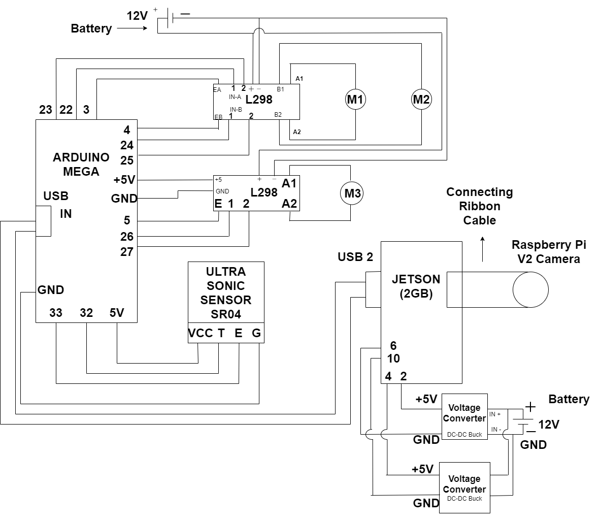
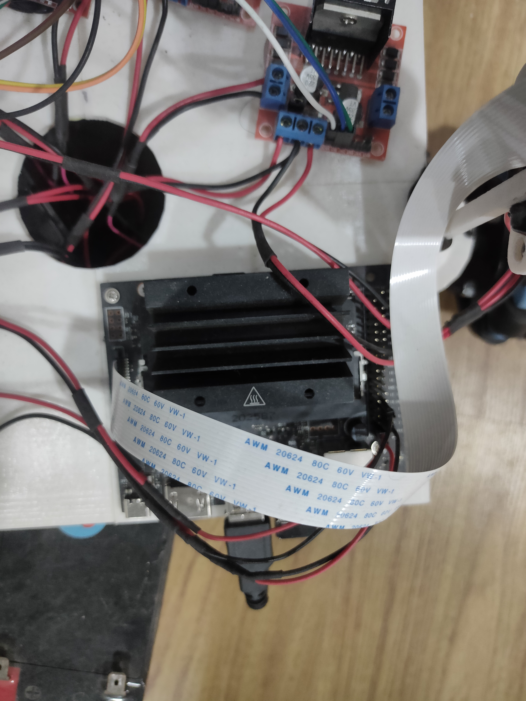
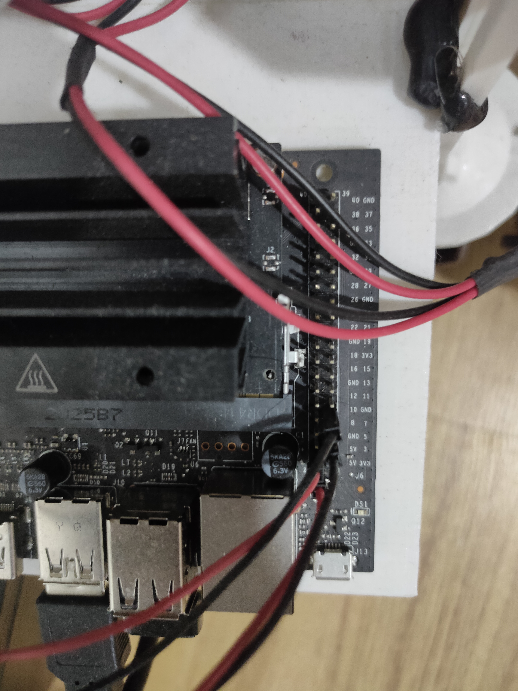
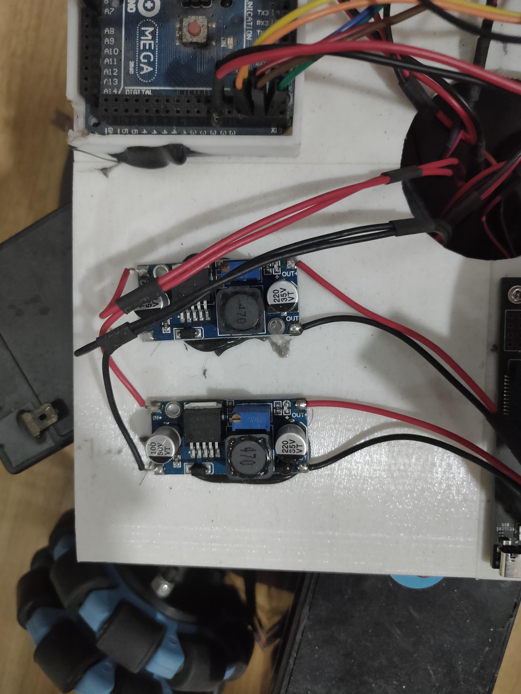
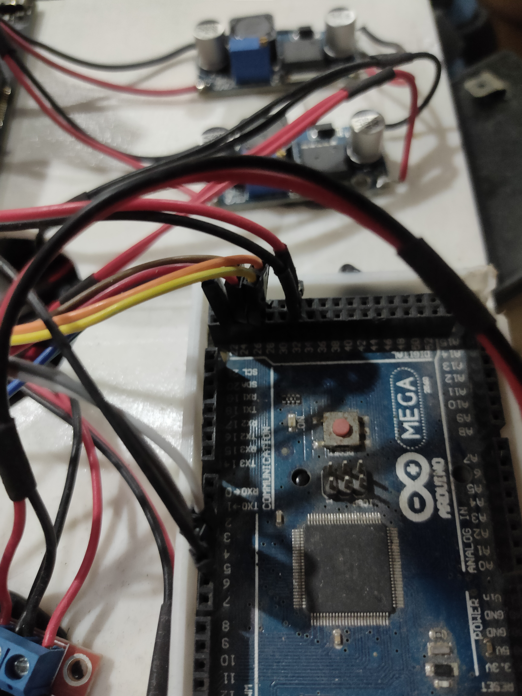
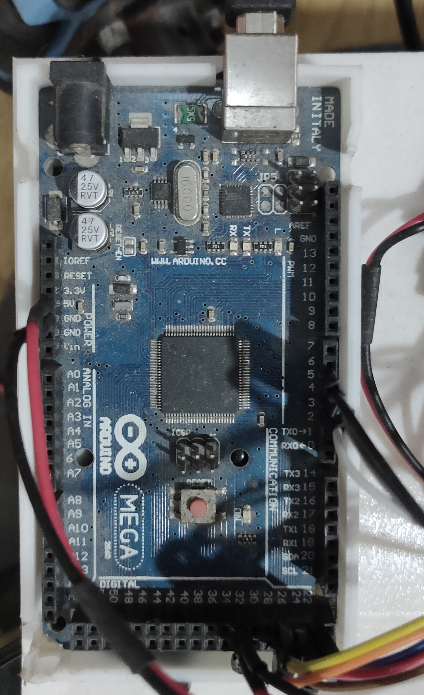

# Omni-Robot
## Introduction
Omni-Robot has 3 wheels seperated at 120 degrees with each other. The geometry and velocity calculations are available in the pdf provided with this repository. This omni wheel robot is autonomous and it detects bottles in its field of vision. It further tracks the first detected object and tries to keep it in the centre of the image frame. The ultrasonic sensor gives the distance between the robot and the tracked object. Motor stops when the distance between robot and bottle is less than 21 centimetres. 
## Components
* Jetson Nano 2GB
* 64GB SD Card
* WiFi dongle
* L298 Motor Driver Shields - 2 (Dual Channel)
* Raspberry Pi v2 camera
* Arduino Mega
* DC-DC Buck Converters - 2
* 12V Batteries - 2
* Omni wheels - 3
* Geared DC Motors - 3
* Circular Frame - 1
* Sufficient Jumper Wires
## Connection Diagram / Block Diagram

 
 
 
 

## Flashing the SD Card with Jetson Nano Jetpack OS
[Click Here to go through each step](https://developer.nvidia.com/embedded/learn/get-started-jetson-nano-devkit)
## Flashing the Arduino Mega with Motor Code
* Connect the Arduino Mega to your system
* Make sure to select the port number and change the board to Arduino Mega in the Arduino IDE
* Open the Omni_Robot_Fixed_Dir.ino file and compile
* Now upload the program to your board and disconnect.
## Step by step connections
* First connect the motors with motor driver shields. 
* Connect the Ultrasonic sensor with the arduino mega
* Connect the motor signal pins of Arduino with Driver shields
* Connect the Raspberry Pi V2 Camera with Jetson Nano CSI port
* Do not connect the batteries and power supply
## Checking the Jetson Nano
* First insert the flashed SD card into Jetson Nano
* Connect the network adapter
* Connect the HDMI cable with monitor
* Now switch on the power supply of Jetson Nano using the original adapter and Type-C port provided
* Complete the first time setup
* Now clone this repository
* Make sure to remember the path and also the IP Address of Jetson NANO
* Connect the USB cable of Arduino Mega with Jetson Nano
* First run the detect-bottles.py using command `sudo python3 detect-bottles.py`
* NOTE: Raspberry Pi V1  Camera doesnt work.
* If camera error is showing up, the possible workaround is to check the connection first and then run a sample code to check the camera working.
* If there is a problem with ACM0 port, check the usb port number by using command `dmesg | grep tty`. Check if the Arduino is connected to /dev/ttyACM0. If it is connected to /dev/ttyACM1, change the same in python code.
## Running the whole model
* Now shut-down the jetson nano (dont forget to note down the IP Address).
* Remove the power from Adapter.
* Place the Robot on floor and place a bottle to track.
* Now power on the Jetson using the Battery (5v buck output)
* Install PuTTY in your laptop and ssh jetson nano using the ip address.
* Enter the password if that was setup for Jetson
* Now change the working directory to the cloned repository path
* Change the working directory to Jetson Codes
* Now run the code using `sudo python3 detect-bottles.py`. If sudo is not used, the program maynot run because the usb ports are only accessed by root user.
## ENJOY THE PROJECT

# Future Scope and Research Possibilities
* Change the camera from Raspberry Pi V2 to 3D Depth camera and remove the need of ultrasonic sensor.
* Lidar can also be integrated with Jetson
* Reduce the lag between communication with Jetson and Arduino
* Use ROS to develop the whole project using Publisher, Subscriber, Actions and Services.
* Improve the speed of motors by using different motors with greater RPM
* Change the Coco model to custom DL model (Trained and Annotated) and can be used in several applications like agricultural, service sector and many other fields.
* Any doubts can be emailed to `okritvik@gmail.com`

* This readme file is updated with the help of Shreya B, student of Keshav Memorial Institute of Technology, Hyderabad
